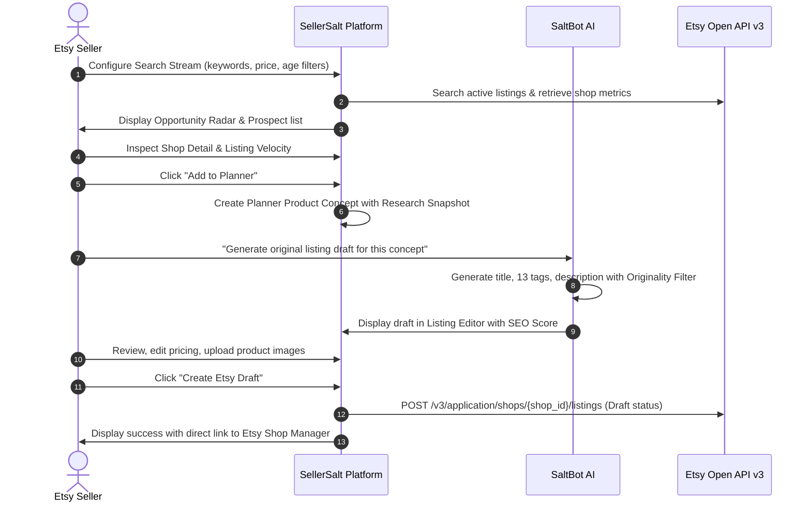
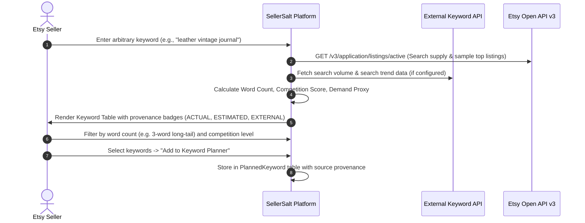
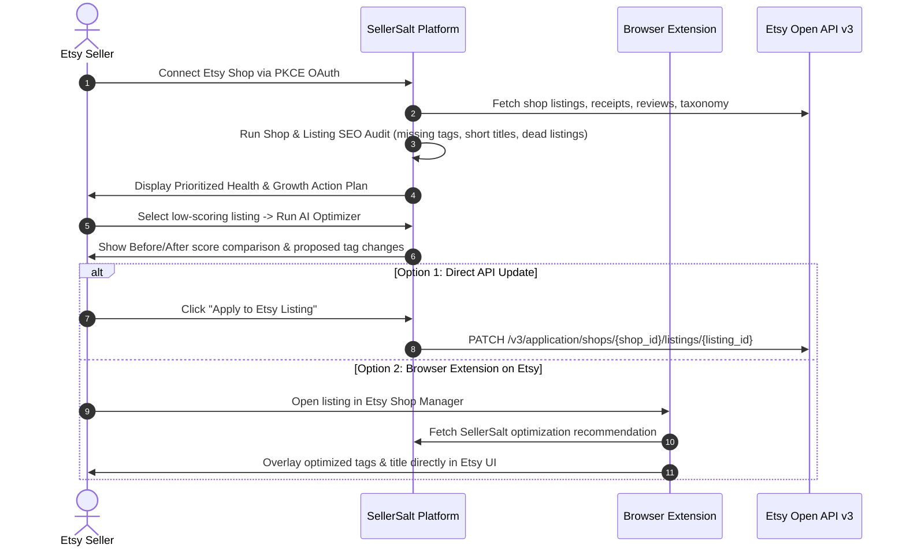

# SellerSalt — Master Product Specification
**All-in-One Etsy Seller Scaling Intelligence & Execution Platform**

- **Document Version:** 2.0.0
- **Status:** Canonical Master Specification
- **Product Classification:** Etsy Intelligence, Planning, Optimization & Execution Platform
- **Target Marketplace:** Etsy (Primary & Customer-Facing Focus)

---

## 1. Executive Summary & Product Vision

### 1.1 The Market Problem
Etsy sellers today operate in a fragmented ecosystem. They discover product ideas in one tool, research keywords in another, calculate profits in spreadsheets, write copy in generic ChatGPT interfaces, and manually copy-paste data into Etsy Shop Manager. This creates severe operational friction, data silos, duplicate work, and risks of accidental competitor listing duplication. Furthermore, existing research tools frequently mislead sellers by inventing fake "Etsy search volume" metrics or failing to distinguish real transaction data from review estimates.

### 1.2 The SellerSalt Solution
**SellerSalt** is an all-in-one Etsy scaling intelligence and execution platform. It unifies the entire e-commerce lifecycle from initial market discovery to final automated draft publishing on Etsy.

```
┌──────────────────────────────────────────────────────────────────────────────────┐
│                             THE SELLERSALT PRODUCT LOOP                          │
│                                                                                  │
│  DISCOVER ──► RESEARCH ──► EVALUATE ──► SHORTLIST ──► PLAN ──► CREATE            │
│     ▲                                                            │               │
│     │                                                            ▼               │
│  IMPROVE ◄── MEASURE  ◄─── EXECUTE ◄─── APPROVE  ◄─── OPTIMIZE ◄─┘               │
└──────────────────────────────────────────────────────────────────────────────────┘
```

1. **DISCOVER**: Continuous monitoring of Etsy niches, emerging trends, break-out shops, and keyword demand.
2. **RESEARCH**: Deep-dive analytics on shop catalogs, listing velocity, pricing distribution, review velocity, and saturation.
3. **EVALUATE**: Algorithmic scoring (Difficulty vs. Demand, Opportunity Score, Revenue Yield) with 100% explainable inputs.
4. **SHORTLIST**: Bookmarking winning signals, competitor inspiration benchmarks, and keyword clusters into workbenches.
5. **PLAN**: Centralizing product concepts, pricing strategies, target tags, and optimization tasks into an actionable Planner.
6. **CREATE**: SaltBot AI generation of **100% original**, SEO-optimized listing titles, structured descriptions, and 13 Etsy tags inspired by research data without copying competitor text.
7. **OPTIMIZE**: Comprehensive listing and shop health audits against Etsy's search algorithm ranking factors.
8. **APPROVE**: Mandatory human review and policy validation before any external write operations.
9. **EXECUTE**: Direct Etsy Open API v3 execution — creating listing drafts, syncing inventory, and publishing updates.
10. **MEASURE**: Closed-loop tracking of connected shop receipts, actual gross/net revenue, fee deductions, and listing conversion velocity.
11. **IMPROVE**: Prioritized actionable recommendations fed back into the Planner to drive continuous growth.

---

## 2. Target Users & Buyer Personas

SellerSalt supports three primary customer tiers while maintaining an Etsy-first user experience:

### 2.1 Individual Etsy Sellers (Starter & Pro)
- **Profile**: Solopreneurs, POD sellers, handmade artisans, digital product creators (printables, templates, SVG bundles).
- **Core Jobs-to-be-Done (JTBD)**:
  - Find high-demand, low-competition digital and physical product niches.
  - Identify exactly why a competitor's listing is selling (sales velocity, price point, tag structure).
  - Generate compliant, original listing content without writer's block.
  - Optimize existing listings to rank higher on Etsy search.
  - Track owned shop revenue, fees, and true profit margins.

### 2.2 E-Commerce Agencies & Growth Consultants
- **Profile**: Marketing agencies managing multiple Etsy client shops.
- **Core JTBD**:
  - Multi-client workspace management with granular permission boundaries.
  - Client shop growth audits and before/after SEO improvement proof reports.
  - Bulk keyword discovery, tag planning, and listing drafting for client catalogs.
  - White-label PDF audit and opportunity reporting.

### 2.3 E-Commerce Institutes & Coaching Academies
- **Profile**: Educators training cohorts of hundreds of new Etsy entrepreneurs.
- **Core JTBD**:
  - Cohort and student seat provisioning.
  - Standardized research curricula and shared discovery streams.
  - Student shop health monitoring and assignment progress tracking.

---

## 3. Product Pillars & Architecture

SellerSalt is structured around **6 Core Pillars**:

```
┌─────────────────────────────────────────────────────────────────────────────────┐
│                           SELLERSALT PRODUCT PILLARS                            │
├─────────────────┬─────────────────┬─────────────────┬───────────────────────────┤
│ 1. DISCOVERY &  │ 2. PLANNER &    │ 3. AI CONTENT & │ 4. STORE ANALYTICS,       │
│    RESEARCH     │    ORGANIZATION │    OPTIMIZATION │    REVENUE & PROFIT       │
├─────────────────┼─────────────────┼─────────────────┼───────────────────────────┤
│ 5. ETSY WRITE & │ 6. SALTBOT AI   │ 7. BROWSER      │ 8. ADMIN & PLATFORM       │
│    EXECUTION    │    COPILOT      │    EXTENSION    │    OPERATIONS             │
└─────────────────┴─────────────────┴─────────────────┴───────────────────────────┘
```

### Pillar 1: Market Discovery & Intelligence
- **Product Hunting**: Prospect streaming across automated search configs with min/max price, shop age, and review filters.
- **Category Hunting**: Taxonomy tree exploration displaying category supply, price distribution, and average sales velocity.
- **Shop Hunting & Spy**: Reverse-engineering competitor shops, historical sales trajectory (`ShopWatch`/`ShopSnapshot`), catalog composition, and dropped/inactive shop recovery.
- **Keyword Research**: Multi-term Etsy search sampling, supply proxy metrics, word count distribution, and external search volume enrichment.
- **Opportunity Radar**: Multi-factor scoring identifying emerging, hidden gem, and growing opportunities.

### Pillar 2: The Planner (The Bridge from Research to Execution)
- Acts as the operational hub connecting research data to listing creation.
- Stores structured planner entities: Product Ideas, Keyword Clusters, Listing Drafts, SEO Tasks, and Social Content.
- Links directly back to research provenance (source shop ID, source listing URL, research snapshot) without copying competitor text.

### Pillar 3: AI Content Generation & Listing Optimization
- **SaltBot AI Generator**: Generates original, brand-tailored titles (under 140 chars), 13 high-intent tags (under 20 chars each), and structured listing descriptions.
- **Originality Protection Layer**: Enforces n-gram overlap checks against competitor listings to guarantee zero copy-pasting.
- **SEO Audit Engine**: Evaluates title keyword placement, tag completeness, description keyword density, category taxonomy alignment, and image attribute completeness.

### Pillar 4: Store Analytics, Revenue & Profit Intelligence
- **OAuth Shop Sync**: Ingests real receipts, transactions, and ledger fees from connected owner shops.
- **True Profit Calculator**: Deducts Etsy transaction fees, payment processing fees, shipping costs, and seller-entered COGS (Cost of Goods Sold).
- **Listing Yield Analysis**: Analyzes revenue per active listing to identify top revenue generators and dead inventory.

### Pillar 5: Direct Etsy Execution (Write-Back)
- Creates listing drafts directly in Etsy Shop Manager via official Open API v3 endpoints.
- Updates existing listings (title, tags, description, price, materials, renewal options).
- Uploads listing images with sequential display ordering.
- Strictly requires human review and confirmation before publishing to live Etsy status.

### Pillar 6: SaltBot AI Domain Assistant
- Deeply integrated conversational agent powered by dynamically routed LLMs (OpenRouter, NVIDIA, Gemini, OpenAI).
- Understands SellerSalt domain entities (prospects, tracked shops, keywords, planner items, store analytics).
- Strictly grounded in real workspace data with clear out-of-scope boundaries to eliminate hallucinations.

---

## 4. Canonical User Journeys

### 4.1 Journey A: New Product Discovery & Publishing


### 4.2 Journey B: Arbitrary Keyword Research


### 4.3 Journey C: Established Shop Health & Listing Optimization


---

## 5. Data Provenance & Honesty Contract

To maintain absolute credibility and regulatory compliance, SellerSalt strictly enforces 4 data classification badges across all UI surfaces:

| Badge | Internal Classification | Definition | Example Fields |
| :--- | :--- | :--- | :--- |
| **`[ACTUAL ETSY DATA]`** | `DATA_PROVENANCE_ACTUAL` | Returned directly and verbatim by Etsy Open API v3. | `transaction_sold_count`, `review_count`, `price`, `creation_timestamp`, `taxonomy_id`, `num_favorers`. |
| **`[ESTIMATED]`** | `DATA_PROVENANCE_ESTIMATED` | Calculated mathematically from actual Etsy data using deterministic, transparent formulas. | `estDailySales` (`totalSales / shopAgeDays`), `avgSellingRatio` (`totalSales / activeListings`), `estMonthlyRevenue`. |
| **`[SELLERSALT SCORE]`** | `DATA_PROVENANCE_SCORE` | Proprietary heuristic algorithms evaluating relative opportunity, competition, or SEO health. | `OpportunityScore` (0-100), `CompetitionLevel` (Very Low to Very High), `ListingSeoScore` (0-100). |
| **`[EXTERNAL DATA]`** | `DATA_PROVENANCE_EXTERNAL` | Sourced from non-Etsy third-party providers or search engine indexes. | Google search trends, third-party keyword search volume indexes. |

### Strict Integrity Rules:
1. Never label an estimated demand or favorite count as "Etsy Search Volume".
2. Never claim real-time sales for arbitrary competitor listings (Etsy only provides lifetime shop sales `transaction_sold_count` publicly, not individual listing order counts).
3. Always explain the mathematical factors behind any calculated score when hovered or clicked.

---

## 6. AI Originality & Quality Contract

1. **Zero Competitor Copying**: AI generation prompts must strictly instruct LLMs to synthesize unique marketing copy, distinct tag combinations, and original product features.
2. **Deterministic Originality Validation**: An automated filter calculates Jaccard similarity and longest common substrings against the source research listing. Drafts exceeding 30% phrase overlap are rejected and re-prompted.
3. **Structured Tag Output**: AI tag generators must produce exactly 13 tags, each containing 20 or fewer characters, avoiding punctuation that Etsy rejects.
4. **Title Optimization**: Listing titles must lead with primary high-intent keywords while remaining natural and readable for human buyers (avoiding spammy keyword stuffing).

---

## 7. Monetization & Plan Tier Mapping

| Feature Pillar | Starter Tier ($19/mo) | Pro Tier ($49/mo) | Agency Tier ($149/mo) |
| :--- | :--- | :--- | :--- |
| **Search Streams** | 3 Active Streams | 15 Active Streams | 50 Active Streams |
| **Prospects Scanned/mo** | 500 Listings | 5,000 Listings | 25,000 Listings |
| **Competitor Shops Tracked** | 5 Shops | 30 Shops | 150 Shops |
| **Connected Etsy Shops** | 1 Shop | 3 Shops | 15 Shops |
| **Keyword Research** | 50 Searches/day | 500 Searches/day | Unlimited |
| **Planner & Drafts** | 25 Drafts | Unlimited Drafts | Unlimited Drafts |
| **SaltBot AI Listing Credits** | 50 Generations/mo | 300 Generations/mo | 1,500 Generations/mo |
| **SEO & Shop Health Audit** | Basic Audit | Full Diagnostic + Fixes | Full Diagnostic + White-label Reports |
| **Direct Etsy Write-Back** | Manual Copy / Drafts | One-Click Draft Push | Bulk Push & Direct Publish |
| **Multi-User Seats** | 1 Seat | 2 Seats | 10 Seats (Employees/Clients) |
