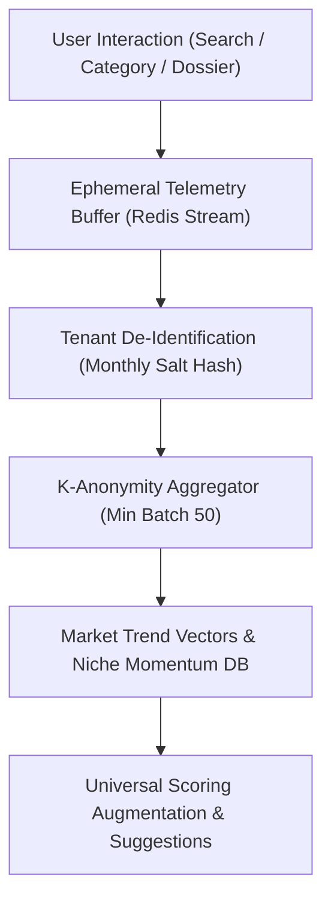

# SellerSalt Intelligence Learning Layer v1 Architecture Specification

## 1. Overview & Vision
The **SellerSalt Intelligence Learning Layer** is a privacy-preserving aggregated telemetry and learning infrastructure designed to continually refine market opportunity scoring, semantic keyword suggestions, niche discovery rankings, and listing recommendations without violating multi-tenant boundaries.

---

## 2. The 5 Core Tenets of SellerSalt Data Privacy

1. **Zero Cross-Tenant Leakage**: Private seller data (drafts, unlinked store secrets, billing, private keywords) is strictly quarantined within `organizationId` boundaries.
2. **K-Anonymity & Aggregation Threshold**: Research telemetry events are aggregated across a minimum cluster size ($k \ge 50$) before informing universal trend vectors.
3. **No Private Scraping or Reverse-Engineering**: Telemetry tracks platform user interaction and publicly verifiable Etsy API metadata, never private seller dashboards of non-connected shops.
4. **Originality & Anti-Duplication Enforcement**: Suggestion models must pass Jaccard/N-gram dissimilarity checks (<15% overlap) to prevent verbatim duplication of competitor copy.
5. **Explainable Deterministic Inputs**: Machine learning outputs serve as augmentations to deterministic, mathematically explainable scoring rubrics, never opaque "black boxes".

---

## 3. Telemetry Event Schema

```typescript
export interface TelemetryEvent {
  eventId: string;
  eventType:
    | "SEARCH_QUERY"
    | "CATEGORY_EXPLORED"
    | "KEYWORD_ANALYZED"
    | "PRODUCT_INVESTIGATED"
    | "SHOP_SURVEILLANCE_STARTED"
    | "OPPORTUNITY_BOOKMARKED"
    | "PLANNER_EXPORTED"
    | "COUNTRY_FILTER_CHANGED";
  anonymizedTenantHash: string; // HMAC-SHA256(orgId, salt_monthly_epoch)
  countryCode: "US" | "UK" | "CA" | "AU" | "DE" | "FR";
  payload: {
    taxonomyId?: number;
    keywordTerm?: string;
    listingCategory?: string;
    priceBucket?: "UNDER_20" | "20_TO_50" | "50_TO_100" | "OVER_100";
    competitionTier?: "LOW" | "MODERATE" | "HIGH" | "SATURATED";
    opportunityTier?: "TIER_1_BREAKTHROUGH" | "TIER_2_VIABLE" | "TIER_3_CHALLENGING";
  };
  timestamp: string; // ISO 8601
}
```

---

## 4. Anonymization & Aggregation Pipeline



### Anonymization Guarantees
- **Monthly Rolling Hash**: `anonymizedTenantHash` rotates every 30 days so long-term behavioral tracking of individual stores is cryptographically impossible across seasons.
- **Payload Stripping**: Strips shop names, seller channel tokens, user emails, and raw custom notes from the learning payload.

---

## 5. Retention & Lifecycle Policy

| Storage Tier | Data Format | Retention Period | Purpose |
| :--- | :--- | :--- | :--- |
| **Hot Buffer (Redis)** | Raw Telemetry Events | 24 Hours | Burst deduplication & stream processing |
| **Warm Store (PostgreSQL)** | Hourly Anonymized Aggregates | 90 Days | Trending niches, velocity surge detection |
| **Cold Vectors (Parquet/S3)** | Niche Cluster Embeddings | 365 Days | Multi-year seasonality curves & model training |

---

## 6. Future Machine Learning & Recommendation Loops

1. **Semantic Search & Vector Embeddings**:
   - Transition from Jaccard keyword similarity to fine-tuned `text-embedding-3-small` vectors indexed in pgvector.
   - Cluster related Etsy taxonomy nodes into cross-category opportunity spaces.
2. **Breakout Niche Classifier**:
   - Multi-factor gradient-boosted tree predicting 30-day velocity surges based on 6-hour surveillance deltas, favorite acceleration, and tag frequency shifts.
3. **Continuous Originality Validator**:
   - Automated post-generation embedding distance check ensuring generated listing drafts maintain $\ge 0.85$ cosine distance from competitor listings.

---

## 7. Compliance & Audit Verification
- Audit logs generated whenever aggregated models are refreshed.
- All telemetry collection respects organizational opt-out flags (`organization.telemetryOptOut: boolean`).
