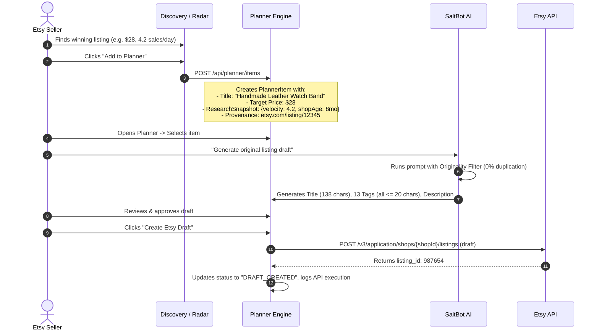

# SellerSalt — Planner Specification
**The Strategic Bridge from Market Research to Etsy Execution**

- **Document Version:** 2.0.0
- **Status:** Canonical Specification
- **System Classification:** Workspace Operations & Execution Management

---

## 1. Executive Purpose & Philosophy

The **Planner** is the core operational engine of SellerSalt. It solves the critical disconnect in existing e-commerce software where market research is treated as disposable data that sits in isolation from actual store execution.

In SellerSalt:
1. **Research is for Inspiration, NOT Copying**: When an opportunity is sent to the Planner, the system captures strategic metadata (price points, demand metrics, keyword clusters) rather than copying competitor listing copy.
2. **Every Plan Leads to an Action**: Every planner object is designed to progress through a defined lifecycle ending in an Etsy listing draft, an SEO update, or a published growth milestone.
3. **Full Audit Provenance**: Every listing draft remembers the research data that inspired it, enabling sellers to evaluate whether their product concept met market expectations after launch.

---

## 2. Planner Data Model & Entity Hierarchy

> **Implementation Status [2026-08-16]:**
> - **Data Foundation (Phase A)**: `COMPLETE`. `PlannerItem`, `ListingDraft`, `ListingSeoAudit`, and `EtsyExecutionLog` are defined in Prisma and typed in `src/types/planner.ts`.
> - **Planner UI Workbenches (Phase H)**: `COMPLETE`. `/planner` Kanban board, table views, detail inspection drawers, CRUD routes, and research snapshot provenance are implemented.
> - **Implementation Modules**: `src/types/planner.ts`, `src/app/api/planner/items/route.ts`, `src/app/api/planner/items/[id]/route.ts`, `src/services/planner-client.ts`, `src/app/(dashboard)/planner/page.tsx`, `src/app/(dashboard)/planner/planner-client.tsx`

```
┌─────────────────────────────────────────────────────────────────────────────┐
│                           PLANNER ENTITY STRUCTURE                          │
├─────────────────────────────────────────────────────────────────────────────┤
│  PLANNER ITEM (Universal Strategic Unit)                                    │
│  ├── Identity: id, organizationId, title, type, status, priority            │
│  ├── Provenance: sourceShopExternalId, sourceListingUrl, researchSnapshot   │
│  ├── Target Strategy: targetCategory, targetPrice, estimatedCogs, keywords  │
│  ├── Execution State: backlog -> in_progress -> draft_created -> published  │
│  │                                                                          │
│  ├── LINKED ARTIFACTS:                                                      │
│  │   ├── AI Listing Draft (Title, 13 Tags, Description, Originality Score) │
│  │   ├── SEO Diagnostic Audit (Title score, Tag score, Issue list)          │
│  │   └── Execution Log (Etsy API push payloads, timestamps, status)         │
└─────────────────────────────────────────────────────────────────────────────┘
```

### 2.1 Supported Planner Object Types
1. **`PRODUCT_IDEA`**: A new product concept inspired by a discovered high-velocity niche or competitor product.
2. **`KEYWORD_CLUSTER`**: A targeted group of primary and long-tail keywords intended for catalog SEO.
3. **`LISTING_DRAFT`**: An in-progress listing payload undergoing copywriting, image assembly, and pricing.
4. **`SEO_OPTIMIZATION_TASK`**: A specific audit finding on an owned listing requiring tag or title updates.
5. **`SHOP_GROWTH_TASK`**: A strategic shop-level improvement (e.g. updating shop announcement, adding 5 new listings in a specific subcategory).
6. **`SOCIAL_CONTENT_PLAN`**: Planned promotional marketing content for Pinterest, Instagram, or TikTok.

---

## 3. Planner Workbenches & UI Views

The Planner provides 4 specialized views tailored to different phases of the scaling workflow:

```
┌─────────────────────────────────────────────────────────────────────────────┐
│                               PLANNER VIEWS                                 │
├─────────────────────────────────────────────────────────────────────────────┤
│ 1. KANBAN WORKBENCH                                                         │
│    Columns: [Backlog] -> [In Planning] -> [Drafting] -> [Ready for Etsy]   │
│    Cards show: Item Title, Target Price, Provenance Tag, SEO Score          │
├─────────────────────────────────────────────────────────────────────────────┤
│ 2. KEYWORD WORKBENCH                                                        │
│    Tag organizer: Group keywords into 13-tag clusters with char counters    │
│    Validation: Flags tags > 20 chars, duplicate words, or trademark risks   │
├─────────────────────────────────────────────────────────────────────────────┤
│ 3. LISTING STUDIO (SaltBot Copywriter)                                      │
│    Split-Screen: [Strategic Strategy & Keywords] | [AI Listing Generator]  │
│    Real-time SEO Score & Originality Check vs Source Inspiration            │
├─────────────────────────────────────────────────────────────────────────────┤
│ 4. SHOP ROADMAP (Action Checklist)                                          │
│    Prioritized checklist generated from Shop Health Audits                  │
│    Direct 1-click execution actions (e.g., [Fix 3 Listings with Short Tags])│
└─────────────────────────────────────────────────────────────────────────────┘
```

---

## 4. The Research-to-Planner Handoff Flow



---

## 5. Originality & Content Protection Rules

1. **Zero Raw Copy Ingestion**: The Planner never ingests competitor descriptions or titles verbatim into the seller's draft fields.
2. **Abstracted Strategy Ingestion**: Only non-copyrightable commercial signals are saved in `researchSnapshot`:
   - Target price range
   - Primary category taxonomy
   - Extracted high-intent search phrases
   - Velocity benchmarks
3. **Human Review Gate**: Planner items cannot be pushed to Etsy without an explicit user review and confirmation click.

---

## 6. API Endpoints for Planner Management

| Method | Endpoint | Description |
| :--- | :--- | :--- |
| **`GET`** | `/api/planner/items` | List all planner items for active organization with status/type filters. |
| **`POST`** | `/api/planner/items` | Create new planner item from research discovery or manual entry. |
| **`GET`** | `/api/planner/items/[id]` | Retrieve specific planner item with linked drafts and SEO audits. |
| **`PATCH`** | `/api/planner/items/[id]` | Update title, strategy, target keywords, user notes, or status. |
| **`DELETE`** | `/api/planner/items/[id]` | Delete planner item and unlink drafts. |
| **`POST`** | `/api/planner/items/[id]/generate-draft` | Trigger SaltBot AI listing creation with originality check. |
| **`POST`** | `/api/planner/items/[id]/push-etsy` | Push approved draft to connected Etsy shop as an official draft. |
