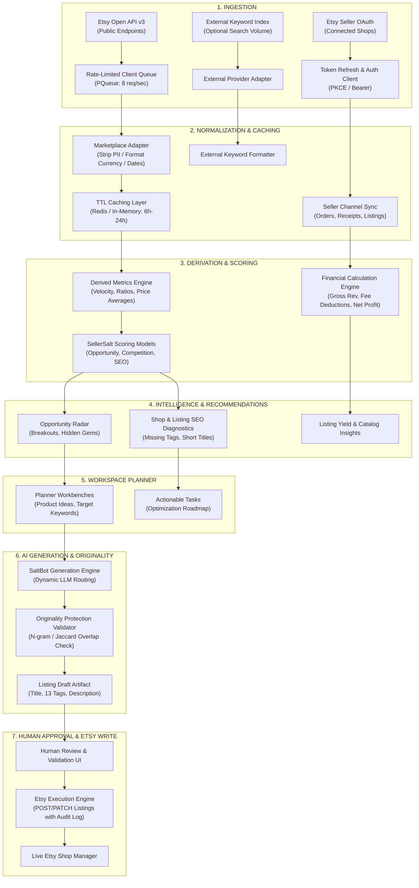

# SellerSalt — Conceptual & Technical Data Architecture

- **Document Version:** 2.0.0
- **Status:** Canonical Architecture Specification
- **Scope:** Complete Data Pipeline, Storage Boundaries, Lifecycle & Schema Strategy

---

## 1. End-to-End Conceptual Data Pipeline

The SellerSalt data pipeline enforces strict unidirectional data flow and rigorous provenance classification at every transition:



---

## 2. Storage Boundaries & Entity Classification

Data in SellerSalt is segregated into 9 distinct architectural tiers to prevent data contamination, protect tenant isolation, and ensure compliance with Etsy API Terms of Service:

```
┌─────────────────────────────────────────────────────────────────────────────┐
│                       SELLERSALT STORAGE BOUNDARIES                         │
├──────────────────────────────────────┬──────────────────────────────────────┤
│ 1. RAW INGESTION / EPHEMERAL CACHE   │ 2. NORMALIZED COMMERCE RECORDS       │
│    • Transient API JSON responses    │    • Normalized listings             │
│    • In-memory / Redis cache (TTL)   │    • Normalized shops                │
│    • Strict TTL (No indefinite PII)  │    • Multi-tenant (organizationId)   │
├──────────────────────────────────────┼──────────────────────────────────────┤
│ 3. HISTORICAL TIME-SERIES            │ 4. CALCULATED DERIVED METRICS        │
│    • ShopSnapshots (sales over time) │    • estDailySales, avgSellingRatio  │
│    • ListingSnapshots (favorites)    │    • reviewVelocity, shopAgeMonths   │
│    • Historical order receipts       │    • Fully deterministic formulas    │
├──────────────────────────────────────┼──────────────────────────────────────┤
│ 5. SELLERSALT PROPRIETARY SCORES     │ 6. INTELLIGENCE & RECOMMENDATIONS    │
│    • OpportunityScore (0-100)        │    • Diagnostic issue flags          │
│    • CompetitionRating (5 levels)    │    • Prioritized growth actions      │
│    • ListingSeoScore (0-100)         │    • Breakout velocity signals       │
├──────────────────────────────────────┼──────────────────────────────────────┤
│ 7. PLANNER WORKSPACE ENTITIES        │ 8. AI GENERATIONS & ORIGINALITY      │
│    • Product ideas, tag workbenches  │    • Generated titles, 13 tags       │
│    • Optimization & growth tasks     │    • Originality audit scores        │
│    • Research snapshot references    │    • Version history                 │
├──────────────────────────────────────┴──────────────────────────────────────┤
│ 9. EXECUTION & AUDIT LOGS                                                   │
│    • Etsy API write payloads, idempotency keys, response codes, actor stamps│
└─────────────────────────────────────────────────────────────────────────────┘
```

---

## 3. Detailed Data Provenance Specifications

Every entity and computed metric must strictly adhere to the following data contracts:

### 3.1 Raw & Normalized Etsy Data (`[ACTUAL ETSY DATA]`)
- **`shopExternalId`**: String identifier returned by Etsy (`shop_id`).
- **`listingExternalId`**: String identifier returned by Etsy (`listing_id`).
- **`totalSales`**: Real lifetime sales count directly from Etsy's `transaction_sold_count`.
- **`reviewCount`**: Total reviews count from Etsy's `review_count`.
- **`reviewAverage`**: Rating average from Etsy's `review_average` (float).
- **`activeListings`**: Active listing count from Etsy's `listing_active_count`.
- **`creationTimestamp`**: Unix epoch timestamp when shop or listing was created.
- **`numFavorers`**: Total favorites count from Etsy listing data.
- **`receiptTotal`**: Actual transaction amount and currency code from owner receipts.

### 3.2 Calculated Derived Metrics (`[ESTIMATED]`)
- **`shopAgeMonths`**: `(Date.now() - creationTimestamp * 1000) / (30.44 * 86400000)`
- **`reviewVelocity`**: `reviewCount / shopAgeMonths` (reviews gained per month).
- **`avgSellingRatio`**: `totalSales / activeListings` (sales yield per active catalog item).
- **`estDailySales`**: `totalSales / (shopAgeMonths * 30.44)` (estimated daily sales velocity).
- **`estMonthlyRevenue`**: `(estDailySales * 30) * averageObservedPrice` (estimated monthly revenue).

### 3.3 SellerSalt Proprietary Scores (`[SELLERSALT SCORE]`)
- **`OpportunityScore`**: Composite 0–100 score weighted by:
  - Daily Sales Velocity: up to +30 pts
  - Low Competition / Review Barrier (<100 reviews): up to +20 pts
  - Catalog Lean Yield (>20 sales/listing): up to +20 pts
  - Shop Freshness (<12 months old): up to +10 pts
  - Impulse Price Range ($15–$60): up to +10 pts
- **`CompetitionRating`**: 5-level classification (`VERY_LOW`, `LOW`, `MODERATE`, `HIGH`, `VERY_HIGH`) based on thresholds of sales volume, review saturation, and seller density.
- **`ListingSeoScore`**: 0–100 diagnostic score evaluating title keyword placement, 13-tag utilization, description structure, and category alignment.

### 3.4 External Data (`[EXTERNAL DATA]`)
- **`externalSearchVolume`**: Search query volume index retrieved from third-party APIs.
- **`searchTrendDirection`**: 12-month search trend curve from search engine indexes.

---

## 4. Prisma Schema Extensions

> **Implementation Status [2026-08-16]:** COMPLETE. The models below have been merged into `prisma/schema.prisma` and applied via non-destructive migration `20260816104000_add_phase_a_foundation_models`.

To support the complete product roadmap, the following models are planned for addition to `prisma/schema.prisma` without disrupting existing tables:

```prisma
// ==========================================
// 1. UNIFIED PLANNER & WORKBENCH
// ==========================================

enum PlannerItemType {
  PRODUCT_IDEA
  KEYWORD_CLUSTER
  LISTING_DRAFT
  SEO_OPTIMIZATION_TASK
  SHOP_GROWTH_TASK
  SOCIAL_CONTENT_PLAN
}

enum PlannerStatus {
  BACKLOG
  IN_PROGRESS
  READY_FOR_DRAFT
  DRAFT_CREATED
  PUBLISHED_TO_ETSY
  COMPLETED
  ARCHIVED
}

model PlannerItem {
  id                   String          @id @default(cuid())
  organizationId       String
  title                String
  type                 PlannerItemType
  status               PlannerStatus   @default(BACKLOG)
  priority             Int             @default(3) // 1=Highest, 5=Lowest
  
  // Research Provenance (Inspiration, NOT Copying)
  sourceShopExternalId String?
  sourceShopName       String?
  sourceListingUrl     String?
  sourceListingTitle   String?
  researchSnapshot     Json?           // Frozen metrics at time of planning (price, velocity, tags)
  
  // Structured Planner Data
  targetCategory       String?
  targetPrice          Float?
  estimatedCogs        Float?
  targetKeywords       String[]        @default([])
  userNotes            String?         @db.Text
  
  dueDate              DateTime?
  completedAt          DateTime?
  createdAt            DateTime        @default(now())
  updatedAt            DateTime        @updatedAt

  organization         Organization    @relation(fields: [organizationId], references: [id], onDelete: Cascade)
  listingDrafts        ListingDraft[]
  seoAudits            ListingSeoAudit[]

  @@index([organizationId, status])
  @@index([organizationId, type])
}

// ==========================================
// 2. AI LISTING DRAFTS & EXECUTION
// ==========================================

enum ListingDraftStatus {
  GENERATED
  EDITED_BY_USER
  APPROVED
  PUSHED_TO_ETSY
  REJECTED
}

model ListingDraft {
  id                   String             @id @default(cuid())
  organizationId       String
  plannerItemId        String?
  sellerChannelId      String?            // Target connected Etsy shop
  
  // Generated & Optimized Listing Fields
  title                String             // Etsy limit: 140 chars
  description          String             @db.Text
  tags                 String[]           // Exactly <= 13 tags, each <= 20 chars
  materials            String[]           @default([])
  price                Float
  quantity             Int                @default(999)
  taxonomyId           Int?               // Etsy taxonomy node ID
  whoMade              String             @default("i_did") // i_did, someone_else, collective
  isSupply             Boolean            @default(false)
  whenMade             String             @default("2020_2026")
  
  // Originality & AI Validation
  originalityScore     Float?             // 0-100 (100 = completely unique vs source)
  maxCommonSubstring   Int?               // Longest matching phrase with source listing
  aiModelUsed          String?            // e.g. "openai/gpt-4o-mini"
  generationPrompt     String?            @db.Text
  
  // Etsy API Execution Tracking
  status               ListingDraftStatus @default(GENERATED)
  etsyListingId        String?            // Set after successful draft creation on Etsy
  etsyDraftUrl         String?
  lastPushedAt         DateTime?
  lastPushError        String?
  
  createdAt            DateTime           @default(now())
  updatedAt            DateTime           @updatedAt

  organization         Organization       @relation(fields: [organizationId], references: [id], onDelete: Cascade)
  plannerItem          PlannerItem?       @relation(fields: [plannerItemId], references: [id], onDelete: SetNull)
  sellerChannel        SellerChannel?     @relation(fields: [sellerChannelId], references: [id], onDelete: SetNull)
  executionLogs        EtsyExecutionLog[]

  @@index([organizationId])
  @@index([plannerItemId])
  @@index([sellerChannelId])
}

// ==========================================
// 3. SEO & SHOP HEALTH AUDIT MODELS
// ==========================================

model ListingSeoAudit {
  id                   String       @id @default(cuid())
  organizationId       String
  plannerItemId        String?
  sellerChannelId      String?
  externalListingId    String?
  
  // Audit Results
  overallScore         Int          // 0-100
  titleScore           Int          // 0-100
  tagScore             Int          // 0-100
  descriptionScore     Int          // 0-100
  attributeScore       Int          // 0-100
  
  // Diagnostic Findings
  titleCharCount       Int
  tagCount             Int          // Target: 13
  tagsOver20Chars      String[]     @default([])
  duplicateTags        String[]     @default([])
  missingAttributes    String[]     @default([])
  issues               Json         // Array of { code, severity, message, recommendation }
  
  createdAt            DateTime     @default(now())

  organization         Organization @relation(fields: [organizationId], references: [id], onDelete: Cascade)
  plannerItem          PlannerItem? @relation(fields: [plannerItemId], references: [id], onDelete: SetNull)

  @@index([organizationId])
  @@index([externalListingId])
}

// ==========================================
// 4. ETSY EXECUTION AUDIT LOG
// ==========================================

enum EtsyActionType {
  CREATE_DRAFT_LISTING
  UPDATE_LISTING
  UPLOAD_IMAGE
  DELETE_LISTING
  SYNC_ORDERS
}

model EtsyExecutionLog {
  id                   String         @id @default(cuid())
  organizationId       String
  sellerChannelId      String
  listingDraftId       String?
  actionType           EtsyActionType
  requestPayload       Json
  responseStatusCode   Int
  responsePayload      Json?
  errorMessage         String?
  idempotencyKey       String         @unique
  executedByUserId     String?
  createdAt            DateTime       @default(now())

  organization         Organization   @relation(fields: [organizationId], references: [id], onDelete: Cascade)
  listingDraft         ListingDraft?  @relation(fields: [listingDraftId], references: [id], onDelete: SetNull)
  sellerChannel        SellerChannel  @relation(fields: [sellerChannelId], references: [id], onDelete: Cascade)

  @@index([organizationId])
  @@index([sellerChannelId])
  @@index([createdAt])
}
```

---

## 5. Caching, Freshness & Rate-Limit Control

> **Implementation Status [2026-08-16]:** COMPLETE (Phase B). Implemented in `src/connectors/etsy/cache.ts` and `src/connectors/etsy/client.ts` with Redis TTL caching, in-memory fallback, exponential backoff, and 8 req/sec queue ceilings.

1. **Etsy Public Search Rate Limits**:
   - Limit: 5 requests/sec, 5,000 requests/day per application keystring.
   - Mechanism: Strict queue rate-limiting via `p-queue` (`intervalCap: 8`, `interval: 1000ms`, configurable via `ETSY_REQUESTS_PER_SECOND`).
   - Caching Policy:
     - Search results cached with a 6-hour TTL (`ETSY_CACHE_TTL.SEARCH_LISTINGS`).
     - Public listing details cached with a 6-hour TTL (`ETSY_CACHE_TTL.LISTING_DETAIL`).
     - Public shop profile metadata cached with a 24-hour TTL (`ETSY_CACHE_TTL.SHOP_PROFILE`).
     - Public shop reviews cached with a 24-hour TTL (`ETSY_CACHE_TTL.SHOP_REVIEWS`).
     - Active buyer taxonomy tree cached with a 7-day TTL (`ETSY_CACHE_TTL.TAXONOMY_NODES`).
     - Taxonomy properties cached with a 7-day TTL (`ETSY_CACHE_TTL.TAXONOMY_PROPERTIES`).
2. **Owner Shop Sync Limits**:
   - Limit: Executed per connected shop on an hourly background schedule or via manual user refresh with a 5-minute cooldown.
   - Access tokens refreshed automatically 60 seconds prior to expiration.
3. **Data Retention & Privacy**:
   - No customer buyer PII (buyer names, shipping addresses) is stored from Etsy receipts. Only financial totals, order numbers, timestamps, and currency codes are recorded in `SellerOrder`.
