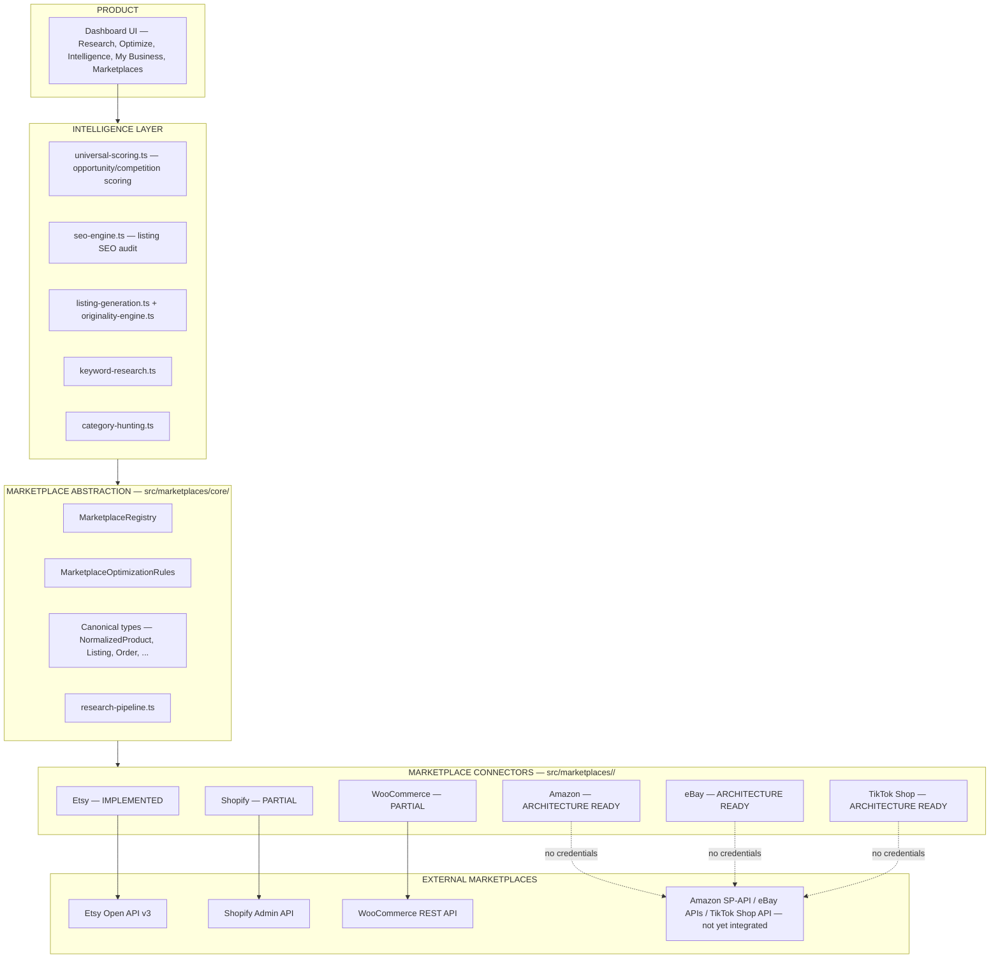
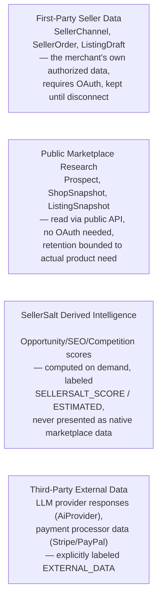
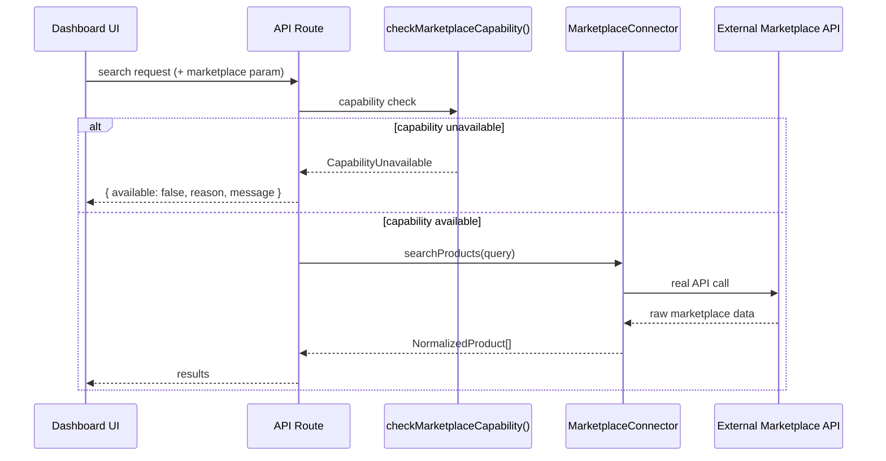
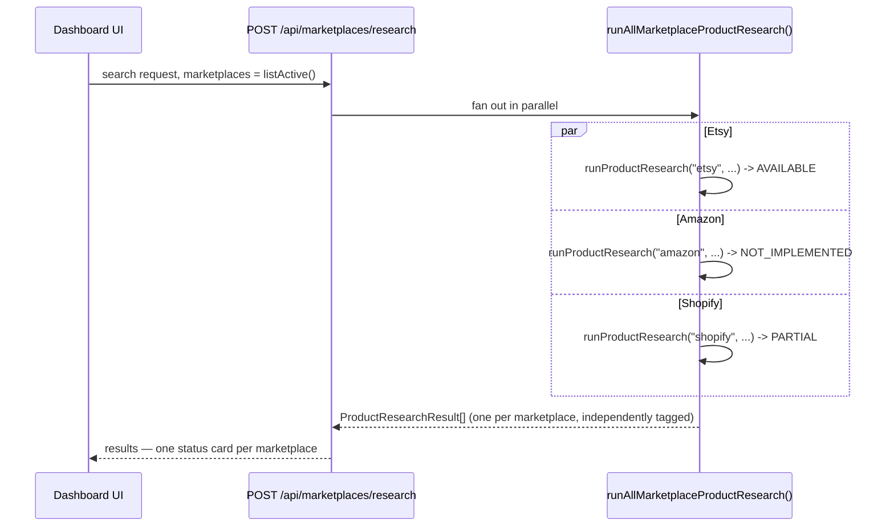

# SellerSalt — Canonical Architecture

**This is the canonical architecture document.** For the deep technical
reference on the marketplace connector layer specifically (interfaces,
registry API, how to add a marketplace), see
`docs/SELLERSALT-MARKETPLACE-ARCHITECTURE.md` — that document is not a
competing source of truth, it's this document's zoomed-in appendix for one
layer. Don't duplicate content between them; this file stays product-wide,
that one stays marketplace-layer-specific.

## The model

**"SellerSalt is an intelligence platform first and a marketplace
connector platform second."** The intelligence layer (scoring, SEO
auditing, AI generation, keyword/category research) is written against
canonical, marketplace-neutral types and marketplace *rules* — never
against a specific connector's raw shape. A connector's only job is
translating one marketplace's real API responses into those canonical
types (or declaring, honestly, that it can't yet).

## Data ownership boundaries

Three categories, referenced from `src/lib/data-retention.ts`,
`AGENTS.md` §4/§12, and this document — every new feature should be able to
say which one its data belongs to:

A row in the database (or a field in an API response) should be traceable
to exactly one of these four. Mixing them without a clear provenance badge
(`ACTUAL_DATA` / `ESTIMATED` / `SELLERSALT_SCORE` / `EXTERNAL_DATA` —
see `src/marketplaces/core/types.ts`'s `SignalProvenance` and the older
`src/services/intelligence/universal-scoring.ts`'s `ProvenanceBadgeType`)
is exactly the kind of thing that caused real problems during the Etsy
compliance review (see `docs/SELLERSALT-ARCHITECTURE-AUDIT.md`).

## Request flow — single marketplace

## Request flow — "All Marketplaces"

One marketplace's connector throwing an exception is caught inside
`runProductResearch` and converted to `{ status: "UNAVAILABLE" }` — it
never propagates and never removes another marketplace's successful
results from the batch.

This same fan-out/error-isolation logic is generalized as
`fanOutMarketplaceRequest<T>()` (same file) and reused — not
reimplemented — by Keyword Research's and Category Hunting's own "All
Marketplaces" modes (`fetchAllMarketplaceKeywordResearch`/
`fetchAllMarketplaceCategoryTree` in their respective services). See
`docs/SELLERSALT-MARKETPLACE-ARCHITECTURE.md`'s "Multi-marketplace
research" section for the full breakdown of which fan-out backs which UI
surface.

## What lives where

| Concern | Layer | Files |
|---|---|---|
| "Is marketplace X capable of Y" | Abstraction | `src/marketplaces/core/{capabilities,registry}.ts` |
| "What are marketplace X's listing rules" | Abstraction | `src/marketplaces/core/optimization-rules.ts` |
| "Translate marketplace X's API response into our shape" | Connector | `src/marketplaces/<x>/connector.ts`, `core/normalizers/<x>.ts` |
| "Score this product/shop's opportunity" | Intelligence | `src/services/intelligence/universal-scoring.ts`, `src/marketplaces/core/opportunity-engine.ts` |
| "Audit this listing's SEO" | Intelligence | `src/services/seo-engine.ts` |
| "Generate an original AI listing draft" | Intelligence | `src/services/listing-generation.ts`, `src/services/originality-engine.ts` |
| "Orchestrate a research request end to end" | Abstraction | `src/marketplaces/core/research-pipeline.ts` |
| "Render the marketplace picker" | Product/UI | `src/components/ui/MarketplaceSelector.tsx` (registry-driven, no hardcoded list) |
| "Fan a request out across every marketplace, isolating failures" | Abstraction | `fanOutMarketplaceRequest<T>()` in `src/marketplaces/core/research-pipeline.ts` |
| "Render one status card per marketplace in a fan-out result" | Product/UI | `src/components/intelligence/AllMarketplacesResults.tsx` (products), `src/components/intelligence/MarketplaceStatusCard.tsx` (keyword/category, generic) |

## Marketplace-aware UI vs. marketplace capability vs. implementation

Three distinct facts, easy to conflate, never interchangeable in
documentation or code comments:

1. **Marketplace-aware UI** — a page renders `MarketplaceSelector` and
   *acts* on the selection (calls a marketplace-parameterized route/
   service instead of hardcoding Etsy). This is a routing/plumbing fact.
   As of 2026-08-19, four surfaces are wired this way: Prospects/Product
   Research, Keyword Research, Category Hunting, and the SEO Audit's
   Draft Playground.
2. **Marketplace capability** — what `MarketplaceCapabilities` on a given
   connector actually asserts as `true` (`src/marketplaces/core/
   capabilities.ts`), verified by test to match what the connector's
   methods actually do.
3. **Actual API implementation** — whether real HTTP calls to that
   marketplace's real API exist and work, which is what capability flags
   are supposed to mirror.

A marketplace being selectable in a `MarketplaceSelector` on a
marketplace-aware surface says **nothing** about #2 or #3 for that
marketplace. Amazon, eBay, and TikTok Shop are selectable everywhere
Etsy is (fact #1, true today) while remaining `ARCHITECTURE READY` —
zero capability flags `true`, zero real API calls (facts #2/#3, also true
today). Selecting one on any of the four wired surfaces returns a
structured `NOT_IMPLEMENTED`/`CapabilityUnavailable` response, never
fabricated data. **Never document "surface X has a marketplace selector"
as "surface X supports marketplace Y" — those are different claims.**
`docs/MARKETPLACE-INTEGRATION-MATRIX.md` is the only document that speaks
to fact #2/#3; this document and `docs/SELLERSALT-MARKETPLACE-
ARCHITECTURE.md` speak to #1.

## Non-negotiable invariants

These are asserted by tests (`src/tests/marketplace-*.test.ts`,
`src/tests/all-marketplaces-ux-and-seo.test.ts`) and must stay true:

1. A connector's `capabilities` flags always match what it can actually do
   — no method is reachable that its capability flag denies.
2. `NormalizedProduct` and its siblings never contain a marketplace-specific
   field name.
3. A capability-unavailable response is structurally distinct from a
   real, empty result set.
4. Etsy's default behavior through every rules-parameterized function
   (`auditListingSeo`, `sanitizeTitle`/`sanitizeTags`,
   `evaluateProductOpportunity`) is unchanged when no explicit rules are
   passed.
5. Research (`src/services/product-hunting.ts`,
   `keyword-research.ts`, `category-hunting.ts`) never imports
   `src/seller-channels/*` — it must work without any connected seller
   account.

## Related documents

- `docs/SELLERSALT-MARKETPLACE-ARCHITECTURE.md` — marketplace layer deep-dive
- `docs/MARKETPLACE-INTEGRATION-MATRIX.md` — current per-marketplace capability table
- `docs/SELLERSALT-ROADMAP.md` — what's next
- `docs/CHANGELOG.md` — how the architecture evolved and why
- `docs/SELLERSALT-ARCHITECTURE-AUDIT.md` — Etsy compliance forensic audit (historical)
- `AGENTS.md` — engineering rules every agent must follow
- `docs/SELLERSALT-HANDOFF.md` — fastest practical orientation
